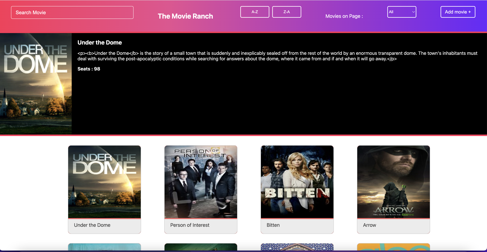

# Movie Application

## Table of Contents
1. [Project Information](#project-information)
2. [Technologies Used](#technologies)
3. [Installation](#installation)
4. [Credits](#credits)

### Project Information

A web application created in html, css and React (JavaScript) which displays movies from tvmaze.com APIg.

#### Features implemented
1. Show movies.
2. Show details of a movie.
3. Search for movies using title(has a bug).
4. Sort movies in ascending or descending order alphabetically.
5. Show movies per page.
6. Add a new movie.
#### Features to be implemented.
1. User login and signin.
2. Watch Trailer Feature.

### Technologies Used
* HTML5
    - provides format to the web app.
* CSS3
    - provides styling to the web app.
* Bootstrap, version 5.1.3
    - to use Bootstrap Css
* React (Javascript), version 18.0.0
    - components and state based application
### Installation
First fork this repository, then clone it on you local machine.
```
$ git clone https://github.com/SandeepSingh1997/React-Movie-app#project-information
$ cd path to which the repo is cloned
$ npm install
$ npm install react-bootstrap bootstrap
$ npm start
```
### Credits
* Prapti M
* Samridhi Aggrawal


